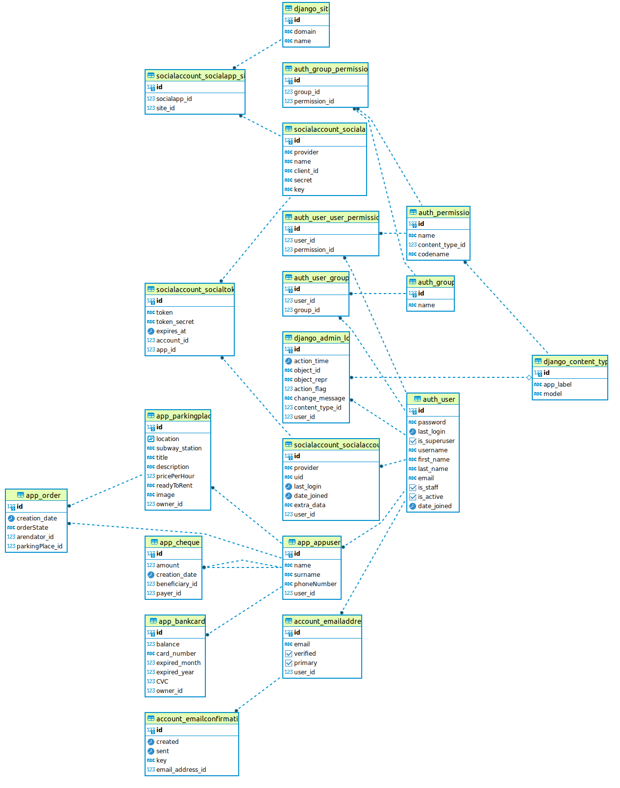

# Share & Park (web app)

## Содержание документации

- 🚀 [Описание проекта](#Описание-проекта)
- 🛠 [Стек технологий](#Стек-технологий)
- 📒 [Возможности сервиса](#Возможности-сервиса)
  - 🏅 [Поиск по каталогу](#ПОИСК-ПО-КАТАЛОГУ)
  - 🏅 [Личный кабинет(ЛК)](#ЛИЧНЫЙ-КАБИНЕТ(ЛК))
  - 🏅 [Управление парковычными мкстами](#УПРАВЛЕНИЕ-ПАРКОВОЧНЫМИ-МЕСТАМИ)
  - 🏅 [Аренда парковочного места](#АРЕНДА-ПАРКОВОЧНОГО-МЕСТА)
  - 🏅 [Детализация доходов и расходов](#ДЕТАЛИЗАЦИЯ-ДОХОДОВ-И-РАСХОДОВ)
- 💻 [Инструкция по установке](#Инструкция-по-установке)
  - 👨‍💻 [Подготовка базы данных](#Подготовка-базы-данных)
  - 👨‍💻 [Запуск проекта](#Запуск-проекта)
  - 👨‍💻 [Docker контейнер](#Инструкция-по-развертыванию-в-Docker-контейнере)
- 👥 [Contributors](#Contributors)


## Описание проекта

Share & Park представляет собой веб-сервис краткосрочной аренды парковочных мест. Благодаря своим функциям сервис выступает в качестве площадки, на которой владельцы парковочных мест могут предложить услуги аренды всем заинтересованным автовладельцам.

## Стек технологий 

В ходе создания проекта применялись различные инстументы и технологии. Они представлены ниже:


## Возможности сервиса

#### ПОИСК ПО КАТАЛОГУ
Каждый пользователь может просматривать каталог парковочных мест других пользователей. Для удобства пользователя предусмотрен поиск по карте, фильтрация по ближайшим станциям метро (отсортированы в алфавитном порядке), стоимости аренды и статусу (готов/не готов к аренде). Также реализован полнотекстовый поиск по адресу парковочного места.  
#### ЛИЧНЫЙ КАБИНЕТ(ЛК) 
После авторизации пользователь сервиса получает доступ в личный кабинет, в котором может создавать/редактировать данные своего профиля (ФИО, номер телефона) и привязывать данные банковской карты (Номер карты, срок действия, CVC/CVV). 
#### УПРАВЛЕНИЕ ПАРКОВОЧНЫМИ МЕСТАМИ
В разделе ЛК "Владелец парковки" каждый авторизованный пользователь может создавать/редактировать/удалять парковочные места. При создании парковочного места требуется указать расположение на карте, добавить фотографию и указать остальные данные (адрес, ближайшее метро, стоимость часа аренды, описание и статус парковочного места).
#### АРЕНДА ПАРКОВОЧНОГО МЕСТА 
Выбрав подходящее парковочное место, пользователь может арендовать его. Так информация об аренде попадает в раздел ЛК "Арендатор". После завешения аренды происходит определение стоимости аренды в пересчете на минуты. Так создается банковский чек, содержащий данные об оплате услуги аренды (бенифициар, арендатор, стоимость аренды, время оплаты).
#### ДЕТАЛИЗАЦИЯ ДОХОДОВ И РАСХОДОВ
На основе данных банковских операций в разделе "Владелец парковки" хранится история пополнения баланса карты за устуги парковки. В соответствии с этим в разделе "Арендатор" хранится история списаний за услуги парковки. 

## Описание схемы БД

База данных в числе остальных содержит 6 ключевых моделей: `Пользователь`, `Парковочное место`, `Аренда`, `Банковская карта`, `Квитанция об оплате`, `Строчка заказа`. Ниже представлена графическая схема моделей и их взаимосвязей.



## Инструкция по установке

### 1. Подготовка базы данных

1.1 Обновляете систему, уставливаете и запускаете Postgres
```sh
sudo apt update
sudo apt install postgis postgresql-14-postgis-3
```

1.2 Заходите в аккаунт Postgres, открываете терминал Postgres, уставливаете и запускаете Postgres
```sh
sudo -i -u postgres 

psql
```
1.3 Создаете базу данных, подключаетесь и устанавливаете расширение для полнотекстового поиска (pg_trgm)
```sh
CREATE DATABASE parking_prod;

\c parking_prod;

CREATE EXTENSION pg_trgm;
```

### 2. Запуск проекта

2.1 Клонируете репозиторий
```sh
git clone https://github.com/XanderMoroz/Moscow_Parking.git
```
2.2 Уставливаете, распаковываете и активируете виртуальное окружение (virtual environment)
```sh
pip3 install virtualenv

virtualenv env

. env/bin/activate
```
2.3 Уставливаете зависимости проекта:
```sh
pip install -r requirements.txt
```
2.4 Переходите в директорию проекта:
```sh
cd ShareAndPark
```
2.5 Создаете и применяете миграции: 
```sh
python3 -m manage makemigrations

python3 -m manage migrate
```
2.6 Создаете нового пользователя:
```sh
python3 -m manage createsuperuser
```
2.7 Запускаете проект:
```sh
python3 -m manage runserver
```

## Инструкция по развертыванию в Docker контейнере:

1. Разворачиваете 3 контейнера (Django + Nginx + Postgis):
```sh
docker compose up build -d
```
2. Заходите через браузер по адресу:
```sh
localhost:8000
```


